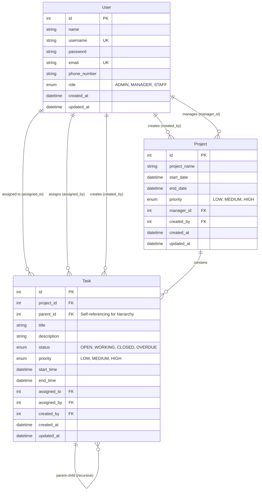

# Entity Relationship Diagram (ERD)

## Database Schema - Project & Task Management System



---

## Table Descriptions

### 👥 **User Table**
Menyimpan data pengguna sistem dengan role-based access control.

**Attributes:**
- `id` - Primary key (auto increment)
- `name` - Nama lengkap user
- `username` - Username unik untuk login
- `password` - Password terenkripsi (bcrypt)
- `email` - Email unik
- `phone_number` - Nomor telepon (opsional)
- `role` - Role: ADMIN, MANAGER, atau STAFF

**Relationships:**
- One-to-Many dengan Project (sebagai creator)
- One-to-Many dengan Project (sebagai manager)
- One-to-Many dengan Task (sebagai assignee)
- One-to-Many dengan Task (sebagai assigner)
- One-to-Many dengan Task (sebagai creator)

---

### 📁 **Project Table**
Menyimpan data project yang dikelola dalam sistem.

**Attributes:**
- `id` - Primary key (auto increment)
- `project_name` - Nama project
- `start_date` - Tanggal mulai project
- `end_date` - Tanggal selesai project
- `priority` - Prioritas: LOW, MEDIUM, HIGH
- `manager_id` - Foreign key ke User (role MANAGER)
- `created_by` - Foreign key ke User (role ADMIN)

**Relationships:**
- Many-to-One dengan User (manager)
- Many-to-One dengan User (creator)
- One-to-Many dengan Task

**Business Rules:**
- Hanya ADMIN yang bisa create/delete project
- MANAGER bisa update project yang di-assign ke mereka
- Project harus di-assign ke user dengan role MANAGER

---

### ✅ **Task Table**
Menyimpan data task dengan struktur hierarki (recursive/self-referencing).

**Attributes:**
- `id` - Primary key (auto increment)
- `project_id` - Foreign key ke Project
- `parent_id` - Foreign key ke Task (self-referencing untuk hierarchy)
- `title` - Judul task
- `description` - Deskripsi detail task
- `status` - Status: OPEN, WORKING, CLOSED, OVERDUE
- `priority` - Prioritas: LOW, MEDIUM, HIGH
- `start_time` - Waktu mulai task
- `end_time` - Waktu deadline task
- `assigned_to` - Foreign key ke User (yang ditugaskan)
- `assigned_by` - Foreign key ke User (yang menugaskan)
- `created_by` - Foreign key ke User (yang membuat)

**Relationships:**
- Many-to-One dengan Project
- Self-referencing: Many-to-One (parent)
- Self-referencing: One-to-Many (children)
- Many-to-One dengan User (assignee)
- Many-to-One dengan User (assigner)
- Many-to-One dengan User (creator)

**Business Rules:**
- Task dapat memiliki parent_id (sub-task)
- Tidak ada batasan kedalaman hierarchy (unlimited nesting)
- Status OVERDUE di-set otomatis oleh background worker
- Saat task di-assign, sistem mengirim email notification

---

## Recursive Hierarchy Example

Task dapat memiliki struktur hierarki tak terbatas:

```
📁 Backend Development (parent_id: null)
├── 📄 API Development (parent_id: 1)
│   ├── 📄 User Authentication API (parent_id: 2)
│   │   └── 📄 JWT Token Generation (parent_id: 3)
│   │       └── 📄 Token Refresh Logic (parent_id: 4)
│   └── 📄 Product API (parent_id: 2)
└── 📄 Database Design (parent_id: 1)
    └── 📄 Create Migrations (parent_id: 7)
```

**SQL Query untuk Recursive Tree:**
```sql
WITH RECURSIVE task_tree AS (
  -- Base case: root tasks (parent_id IS NULL)
  SELECT * FROM "Task" WHERE parent_id IS NULL
  
  UNION ALL
  
  -- Recursive case: children tasks
  SELECT t.* FROM "Task" t
  INNER JOIN task_tree tt ON t.parent_id = tt.id
)
SELECT * FROM task_tree;
```

---

## Indexes

Untuk performa optimal, terdapat index pada:

### User Table:
- `username` (UNIQUE)
- `email` (UNIQUE)

### Project Table:
- `manager_id`
- `created_by`

### Task Table:
- `project_id`
- `parent_id` (penting untuk recursive query)
- `assigned_to`
- `assigned_by`
- `created_by`

---

## Foreign Key Constraints

### On Delete Behaviors:

| Table   | Foreign Key  | On Delete   | Reason |
|---------|-------------|-------------|---------|
| Project | manager_id  | SET NULL    | Project tetap ada meskipun manager dihapus |
| Project | created_by  | SET NULL    | Audit trail preserved |
| Task    | project_id  | CASCADE     | Task dihapus jika project dihapus |
| Task    | parent_id   | SET NULL    | Child task jadi root task jika parent dihapus |
| Task    | assigned_to | SET NULL    | Task tetap ada, assignment di-reset |
| Task    | assigned_by | SET NULL    | Audit trail preserved |
| Task    | created_by  | SET NULL    | Audit trail preserved |

---

## Enums

### Role
```sql
CREATE TYPE "Role" AS ENUM ('ADMIN', 'MANAGER', 'STAFF');
```

| Value   | Description |
|---------|-------------|
| ADMIN   | Full access: CRUD users, projects, tasks |
| MANAGER | Manage assigned projects & tasks, assign staff |
| STAFF   | Manage assigned tasks only |

---

### ProjectPriority & TaskPriority
```sql
CREATE TYPE "ProjectPriority" AS ENUM ('LOW', 'MEDIUM', 'HIGH');
CREATE TYPE "TaskPriority" AS ENUM ('LOW', 'MEDIUM', 'HIGH');
```

| Value  | Description |
|--------|-------------|
| LOW    | Prioritas rendah |
| MEDIUM | Prioritas sedang (default) |
| HIGH   | Prioritas tinggi |

---

### TaskStatus
```sql
CREATE TYPE "TaskStatus" AS ENUM ('OPEN', 'WORKING', 'CLOSED', 'OVERDUE');
```

| Value    | Description |
|----------|-------------|
| OPEN     | Task baru dibuat, belum dikerjakan |
| WORKING  | Task sedang dikerjakan |
| CLOSED   | Task selesai |
| OVERDUE  | Task melewati deadline (auto-set by worker) |

**Status Flow:**
```
OPEN → WORKING → CLOSED
  ↓       ↓
OVERDUE (auto jika melewati end_time)
```

---

## Database Statistics

Setelah seeding, database berisi:

- **Users**: 3 (1 Admin, 1 Manager, 1 Staff)
- **Projects**: 1 (Website Redesign)
- **Tasks**: ~5 (dengan hierarki 2-3 level)

---

## View SQL Migration

File SQL migration lengkap: [`prisma/migrations/20260606000000_init/migration.sql`](../prisma/migrations/20260606000000_init/migration.sql)

File Prisma Schema: [`prisma/schema.prisma`](../prisma/schema.prisma)

---

## Technical Implementation Notes

### Recursive Query Performance
- Menggunakan index pada `parent_id` untuk performa query hierarki
- Cache tree view untuk menghindari recursive query berulang
- Cache invalidation otomatis saat task CRUD

### Security
- Password di-hash menggunakan bcrypt
- JWT authentication untuk API access
- RBAC middleware untuk authorization
- Foreign key constraints untuk data integrity

### Background Jobs
- **Overdue Worker**: Check task yang melewati `end_time` setiap 1 jam
- **Email Worker**: Consume queue untuk kirim notification saat assignment

---

*Generated from Prisma Schema v5.x*  
*Last Updated: June 2026*
